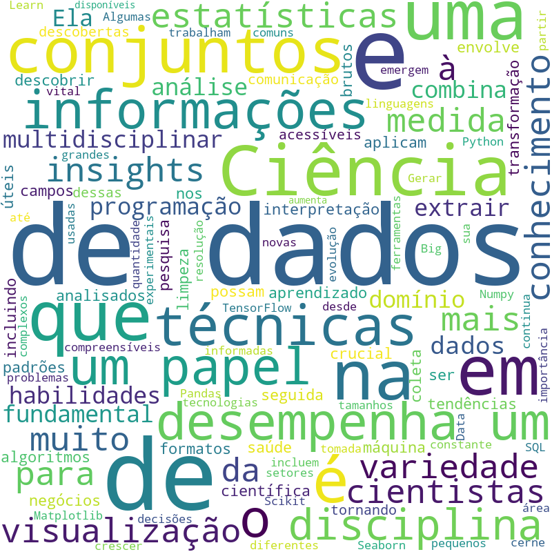

# Gerador de Nuvem de Palavras
Este é um projeto simples que demonstra como criar uma nuvem de palavras a partir de um texto utilizando o Streamlit e o pacote WordCloud em Python. Neste caso, o texto base é relacionado à área de Ciência de Dados.



## Requisitos

Certifique-se de ter Python instalado no seu sistema e as seguintes bibliotecas:

- [Streamlit](https://streamlit.io/)
- [WordCloud](https://github.com/amueller/word_cloud)

Você pode instalar essas bibliotecas usando o pip:

```bash
pip install streamlit
pip install wordcloud
```
## Como Usar

1. Clone ou faça o download deste repositório em seu ambiente local.

2. Abra um terminal ou prompt de comando e navegue até o diretório do projeto.

3. Execute o aplicativo Streamlit com o comando:

```bash
streamlit run app.py
```
1. O aplicativo Streamlit será iniciado no seu navegador padrão.

2. Clique no botão "Faça o upload de um arquivo de texto" e faça o upload de um arquivo de texto.

3. Após o upload, clique no botão "Gerar Nuvem de Palavras" para gerar a nuvem de palavras.

4. A nuvem de palavras gerada será exibida no aplicativo.
